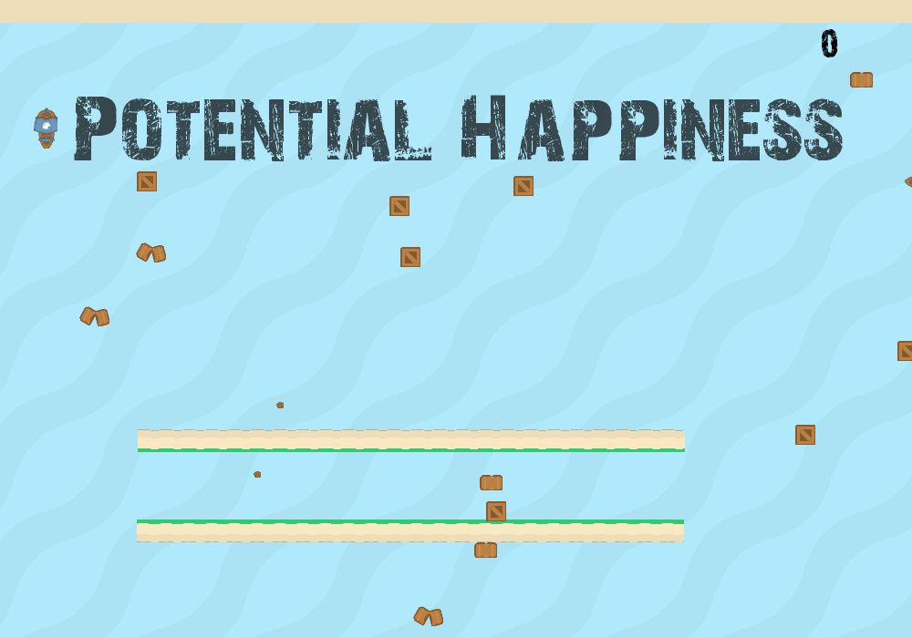
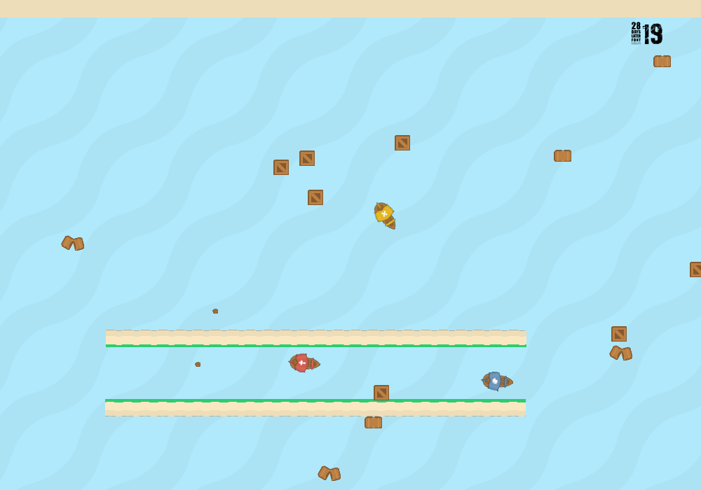
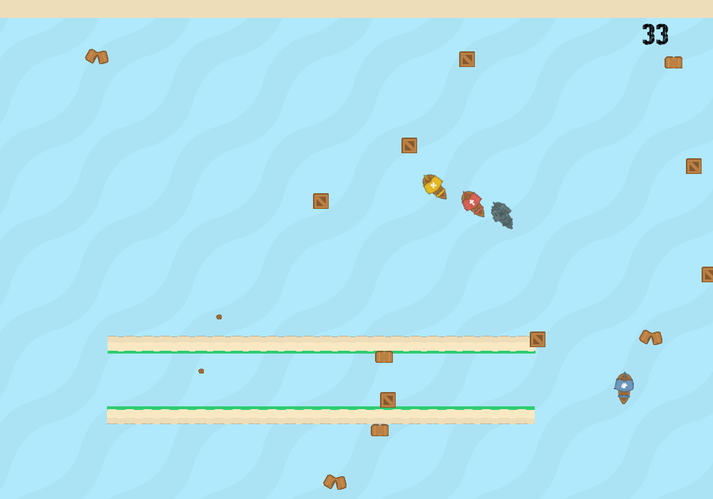

# Glynn_finalprojectAY26
Class project
## Title Screen




## Lore
You are an experienced traveller guiding your ship through the 7 seas. A hurricane has come through your area and demolished many merchant, pirate, and royal ships, leaving their loot floating in the ocean. You and your crew navigate through the ocean to collect as much loot as possible. But be weary, the ghosts of the ships are still on the water and hunt whoever dares take their loot. If the ghost ships get close enough to board, they will steal back what is rightfully, or wrongfully, theirs

## Directions
1. Use the ```w``` key to move up
2. Use the ```s``` key to move down
3. Use the ```a``` key to move left
4. Use the ```d``` key to move right
5. Use the ```t``` key to drop anchor and slow your speed significantly
6. Survive as long as possible, once your score is zero your time is up
7. If your score ever reaches zero, the game is over
